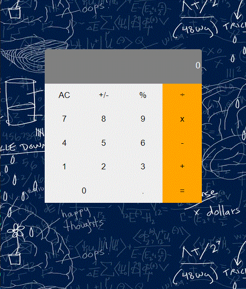

# Math-Magician

This is a calculator app build by react library.

## Built With

- ReactJS

## Get Live Demo

[Live Demo Netlify Link](https://hammasmath.netlify.app/)

## Clone and review it

Run the following commands to clone and run it.

### To clone the repository

  `git clone git@github.com:HAMMAS-SALEEM/Math-Magician.git`

### To enter Directory

`cd Math-Magician`

### To Install Packages

`npm install`

### To run project on local server

`npm start`

### To run project tests

`npm test`

### To open project with vs code 

`code .`

## Authors

👤 **Hammas Bin Saleem**

- GitHub: [@HAMMAS-SALEEM](https://github.com/HAMMAS-SALEEM)
- Twitter: [@HammasSaleem4](https://twitter.com/HammasSaleem4)
- LinkedIn: [HAMMAS SALEEM](https://www.linkedin.com/in/hammas-saleem-407)

## 🤝 Contributing
Contributions, issues, and feature requests are welcome!
Feel free to check the [issues page](../../issues/).

## Show your support
Give a ⭐️ if you like this project!

## Acknowledgments
- Hat tip to anyone whose code was used
- Inspiration
- etc

## 📝 License
This project is [MIT](./MIT.md) licensed.
